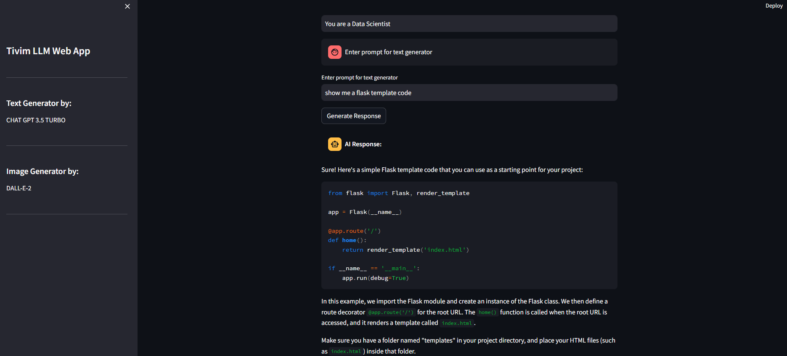
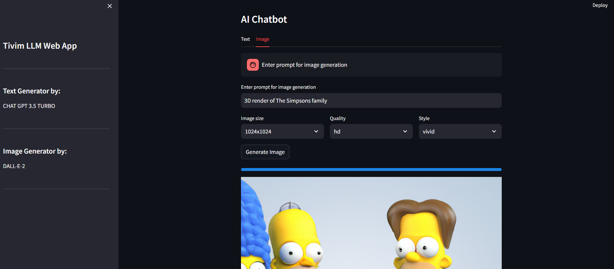

# Projeto OpenAI Images

Este é um projeto para gerar imagens usando OpenAI e Streamlit. Abaixo, algumas imagens representativas:
--

<p align="center">
  
</p>

--

<p align="center">
  
</p>

--

## Estrutura do Projeto

```
openai-images/
  ├── src/
  │   ├── app/
  │   │   ├── app.py
  │   │   └── utils/
  │   └── requirements.txt
  ├── Dockerfile
  └── other_files...
```

- `app/`: Pasta contendo o código da aplicação.
  - `utils/`: Pasta com os pacotes de utilitários.
- `docker/`: Contém o Dockerfile e outros arquivos relacionados ao Docker.
- `requirements.txt`: Lista de dependências Python.
- `README.md`: Este arquivo com informações sobre o projeto.


## Estrutura do Dockerfile
```
# Usa a imagem base do Python
FROM python:3.10


# Configura o diretório de trabalho no contêiner
WORKDIR /app

ENV OPENAI_API_KEY='SUA_CHAVE_DE_API'

# Copia o código fonte para o contêiner
COPY src/app /app

# Copia o arquivo requirements.txt para o contêiner
COPY requirements.txt /app/requirements.txt

RUN pip install --upgrade pip

# Instala as dependências do Python
RUN pip install -r /app/requirements.txt

# Copia os pacotes da pasta utils
COPY src/app/utils /app/utils

EXPOSE 8501

# Comando para iniciar a aplicação
CMD ["streamlit", "run", "app.py"]
```

## Instruções para Execução Localmente

1. **Clonar o repositório:**
   ```bash
   git clone https://github.com/seu_usuario/openai-images.git
   cd openai-images
   ```

2. **Instalar dependências:**
   Certifique-se de ter o Docker instalado. Para executar localmente, use:
   ```bash
   docker build -t openai-images .
   docker run -p 8501:8501 openai-images
   ```

3. **Acessar a aplicação:**
   Acesse a aplicação em `http://localhost:8501` no seu navegador.

## Deploy no AWS EC2

Para implantar no EC2, siga as instruções abaixo:

1. **Criar uma instância EC2:**
   - Configure uma instância EC2 com o Docker instalado.
   - Clone o repositório no EC2.

2. **Executar a aplicação:**
   No terminal do EC2, navegue até o diretório do projeto e execute:
   ```bash
   docker build -t openai-images .
   docker run -p 8501:8501 openai-images
   ```

3. **Acessar a aplicação:**
   Acesse a aplicação através do endereço público do seu EC2.
